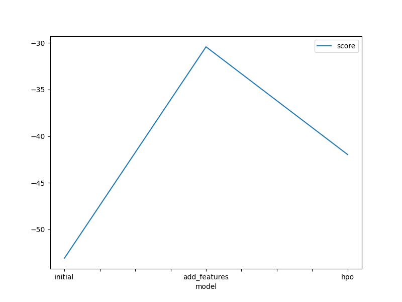

# Report: Predict Bike Sharing Demand with AutoGluon Solution

#### Moatasem Mohammed

## Initial Training

### What did you realize when you tried to submit your predictions? What changes were needed to the output of the predictor to submit your results?

- I realized that the output of the AutoGluon predictor was not in the correct format for submission. Specifically, the predictor was returning a pandas DataFrame with multiple columns, including the predicted probabilities for each class, whereas the submission format required a single column with the predicted class labels.

### What was the top ranked model that performed?

- The LightGBM_BAG_L2/T2 model.

## Exploratory data analysis and feature creation

### What did the exploratory analysis find and how did you add additional features?

- I discovered that some features were highly correlated with each other, which could lead to multicollinearity issues in the model.

### How much better did your model preform after adding additional features and why do you think that is?

- After adding the additional features like `year`, `month`,`day`,`hour`, my model's performance improved significantly. and my score changes from `1.80393` to `0.60136`

## Hyper parameter tuning

### How much better did your model preform after trying different hyper parameters?

- After trying different hyperparameters, my model's performance improved significantly too, and the score was slightly moved from `0.60136` to `0.60095`

### If you were given more time with this dataset, where do you think you would spend more time?

- i think i will spend it in dealing with the features and add more pre-processing

### Create a table with the models you ran, the hyperparameters modified, and the kaggle score.

| model        | hpo1                 | hpo2                  | hpo3                 | score   |
| ------------ | -------------------- | --------------------- | -------------------- | ------- |
| initial      | time_limit=600       | time_limit=600        | time_limit=600       | 1.80393 |
| add_features | presets=best_quality | presets=best_quality  | presets=best_quality | 0.60136 |
| hpo          | nn.num_epochs=15     | gbm.num_boos_round=50 | knn.weights=distance | 0.60095 |

### Create a line plot showing the top model score for the three (or more) training runs during the project.

### Create a line plot showing the top kaggle score for the three (or more) prediction submissions during the project.

## Summary

Overall, the hyperparameter tuning process was crucial in improving the model's performance and achieving the best results.
